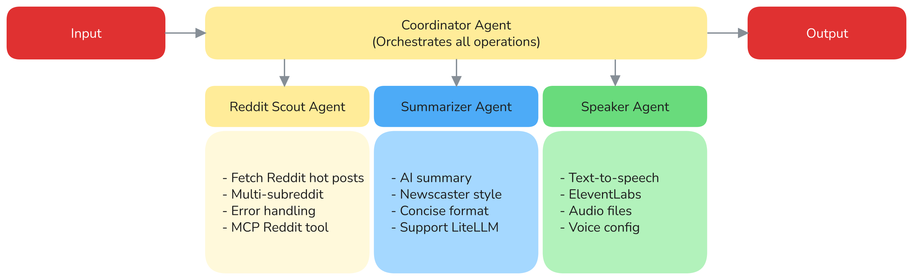

# Simple Chatbot
[](https://github.com/TiieuTiien)
[](https://opensource.org/licenses/MIT)

*An intelligent multi-agent system for **fetching news** on reddit, **sumarize** it and generate **audio content***

## About

The Simple Chatbot is a sophisticated ADK-powered multi-agent system that revolutionizes how developers stay informed about game development trends. Built with Google's Agent Development Kit (ADK), this project combines Reddit data mining, AI-powered summarization, and text-to-speech capabilities to deliver personalized gaming industry insights through multiple channels including web interfaces, APIs, and audio content.

**Key Features:**
- **Real-time Reddit Integration**: Live data from r/gamedev, r/unity3d, r/unrealengine and more
- **AI-Powered Summarization**: Intelligent content curation in professional newscaster style  
- **Text-to-Speech Generation**: Convert summaries to high-quality audio using ElevenLabs
- **Multi-Agent Architecture**: Coordinated system with specialized Reddit Scout, Summarizer, and Speaker agents
- **Flexible Deployment**: Run as CLI tools, web applications, or A2A (Agent-to-Agent) servers

Whether you're a game developer wanting audio briefings during commutes, a studio manager needing quick industry updates, or a researcher tracking gaming technology trends, this system provides intelligent, automated content delivery tailored to your workflow.

## Agent workflow

<html>
    <h2 align="center">
      
    </h2>
<html>

## Project Structure

```
simple-chatbot/
├── README.md                # Project documentation
├── requirements.txt         # Python dependencies
├── .gitignore               # Ignore unnecessary files
├── apps/                   # Streamlit applications
│   └── speaker_app.py      # Web interface for the chatbot
├── agents/                 # ADK agents directory
│   ├── __init__.py
│   ├── .env.example        # Environment template
│   ├── .env                # Environment variables (not in git)
│   ├── coordinator/        # Main orchestrator agent
│   │   ├── __init__.py
│   │   └── agents.py
│   ├── async_reddit_scout/ # Reddit data fetching agent
│   │   ├── __init__.py
│   │   ├── agents.py       # Reddit API integration
│   │   └── tools/          # MCP Reddit tools
│   ├── summarizer/         # AI content summarization agent
│   │   ├── __init__.py
│   │   └── agents.py       # News summarization logic
│   └── speaker/            # Text-to-speech agent
│       ├── __init__.py
│       ├── agents.py       # ElevenLabs TTS integration
│       └── audio_output/   # Generated audio files
├── scripts/                # Testing and utility scripts
│   └── test/
│       └── speaker/
│           └── test_extract_audio.sh
├── tests/                  # Unit tests
└── .venv/                  # Virtual environment (local)
```

## Installation for Users

### Quick Start (Recommended)
```bash
# Clone and set up the project
git clone git@github.com:TiieuTiien/simple-chatbot.git
cd simple-chatbot

# Create virtual environment
python -m venv .venv
source .venv/bin/activate  # On Windows: .venv\Scripts\activate

# Install dependencies
pip install -r requirements.txt

# Configure environment
cp agents/.env.example agents/.env
# Edit agents/.env with your API keys (see Configuration section)

# Run the Streamlit web app
streamlit run apps/speaker_app.py
```

### Configuration

Edit `agents/.env` with your API credentials:

```bash
# Google AI API (required)
GOOGLE_API_KEY="your-google-ai-studio-api-key"

# OpenRouter API Key (For OpenRouter models)
OPENROUTER_API_KEY="paste-your-openrouter-api-key-here"

# Reddit API (required for live data)
REDDIT_CLIENT_ID="your-reddit-client-id" 
REDDIT_CLIENT_SECRET="your-reddit-client-secret"
REDDIT_USER_AGENT="YourApp/1.0 by YourUsername"

# ElevenLabs API (required for text-to-speech)
ELEVENLABS_API_KEY="your-elevenlabs-api-key"
```

**Get API Keys:**
- [Google AI Studio](https://aistudio.google.com/) - Free tier available
- [OpenRouter](https://openrouter.ai/) - Free tier available
- [Reddit API](https://www.reddit.com/prefs/apps) - Free for personal use
- [ElevenLabs](https://elevenlabs.io/) - Free tier with 10k characters/month

### Usage Examples

**Web Interface:**
```bash
# Navigate to agents folder
cd agents

# Launch adk default web interface
adk web
```

**Custom Web Interface:**
```bash
# Start the ADK API server
adk api_server

# Launch Streamlit chat interface (in another terminal)
streamlit run apps/speaker_app.py
```

**CLI Mode:**
```bash
# Run individual agents
adk run agents/reddit_scout     # Reddit news fetching
adk run agents/summarizer       # AI summarization
adk run agents/speaker          # Text-to-speech
adk run agents/coordinator      # Full pipeline
```

**Try these prompts:**
- "Get me the latest game development news"
- "Summarize hot posts from r/unity3d"  
- "Read me the latest updates from r/unrealengine"
- "What's trending in gamedev and speak it to me"

## Installation for Contributors

### Development Setup
```bash
# Clone with development dependencies
git clone git@github.com:TiieuTiien/simple-chatbot.git
cd simple-chatbot

# Set up development environment
python -m venv .venv
source .venv/bin/activate
pip install -r requirements.txt
```

### Local Testing
```bash
# Test individual agents
cd agents/reddit_scout && adk run .
python -m agents.speaker

# Test API endpoints
curl -X POST "http://localhost:8000/run" \
  -H "Content-Type: application/json" \
  -d '{"app_name": "speaker", "user_id": "test", "session_id": "123", "new_message": {"parts": [{"text": "Hello"}], "role": "user"}}'

# Test audio extraction
./scripts/test/speaker/test_extract_audio.sh
```

## Contributing Guidelines

We welcome contributions! Please follow these guidelines:

**Before submitting:**
- Create an issue first to discuss major changes
- Ensure all tests pass: `python -m pytest`
- Follow existing code style and patterns
- Update documentation for new features

**Pull Request Requirements:**
- Squash commits into logical units
- Include tests for new functionality  
- Update README if adding user-facing features
- Reference the issue number in PR description

**Code Standards:**
- Use type hints where possible
- Follow Google-style docstrings
- Keep functions focused and well-named
- Add logging for debugging and monitoring

**Agent Development:**
- Follow ADK patterns and conventions
- Include proper error handling and fallbacks
- Test with mock data when APIs unavailable
- Document environment variables and dependencies

## Support This Project

If this project helps you stay informed about game development trends or saves you time, consider:

- ⭐ **Star this repository** to help others discover it
- 🐛 **Report bugs** or suggest improvements via issues
- 🔄 **Share with fellow developers** who might benefit
- 💡 **Contribute code** - see Contributing Guidelines above

---

*Inspired by [AI Oriented Dev's ADK Tutorial](https://youtu.be/BiP4tKZKTvU) - Building practical AI agent systems for real-world applications.*